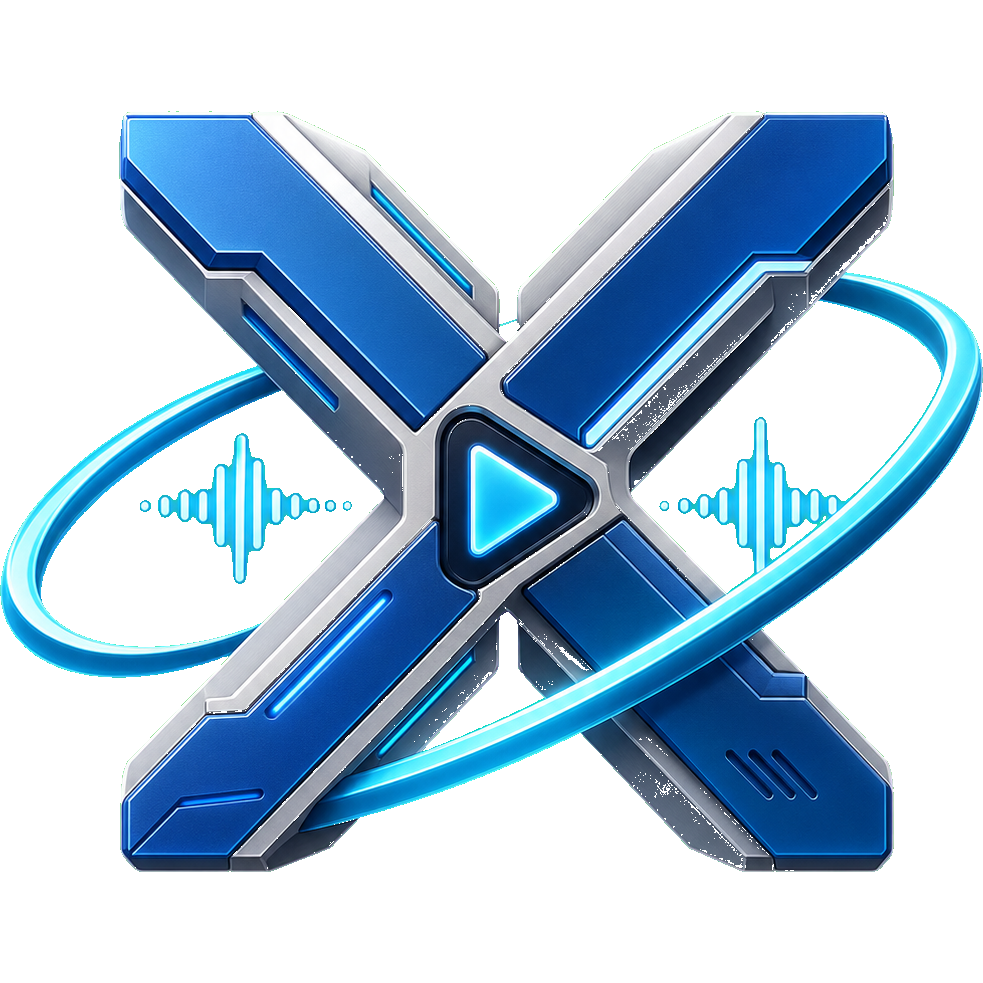

<p align="center">
  
</p>

<p align="center">
  
</p>

# Media Player X-Ark

Media Player X-Ark は、Windows 向けのメディアプレイヤーです。

学生時代に Visual Basic 6 で作成していた先代 X-Ark を、C# / .NET WinForms へ移植しながら、現在の Windows 環境に合わせて作り直しています。音楽ファイルの再生だけでなく、CD 再生、リッピング、MIDI 再生、スキン、プラグイン、Discord 連携などを備えています。

## できること

### 音楽ファイルの再生

一般的な音声ファイルの再生に対応しています。再生エンジンには FMOD を利用し、プレイヤーとして必要な操作や表示を X-Ark 側で補っています。

### CD 再生とリッピング

オーディオ CD の再生に対応しています。CD からのリッピングも可能で、FLAC / ALAC 形式で保存できます。

CDDB / MusicBrainz から情報を取得できるため、環境やディスクによってはアルバム名、曲名、アーティスト名、カバーアートなどを補完できます。

### MIDI 再生

標準 MIDI エンジンを搭載しています。DLS / SF2 サウンドフォントに対応しており、外部 MIDI エンジンを導入した場合は設定から切り替えできます。

### スペクトラム表示

再生中の音声に合わせた Wave スペクトラム表示に対応しています。

### スキン

見た目を変更するスキン機能を搭載しています。今代の X-Ark では JSON 形式のスキン設定を利用します。

先代 X-Ark のスキンとは形式が異なるため、そのまま利用できない場合があります。スキン作成や変換については、別リポジトリの SkinCreator を利用する想定です。

### プラグイン

コーデックや外部機能をプラグインとして追加できる構成です。ライセンスの都合で本体に直接同梱しにくい機能も、別リポジトリから導入できるようにしています。

### Discord 連携

Discord Rich Presence に対応しています。利用する場合は、利用者側で API キーなどの設定が必要です。

### ファイル情報表示

再生ファイルのタグ情報を表示できます。タグにカバーアートが含まれている場合は、画像も表示できます。

## 使い方

基本的な使い方は [`Docs/`](Docs/) 配下のヘルプを参照してください。

配布版を利用する場合は、リリースに含まれる実行ファイルを起動してください。ソースコードから起動する場合は、後述の「開発者向け情報」を参照してください。

## 注意事項

- Windows 専用アプリケーションです。
- 一部の機能は外部サービス、外部 DLL、プラグイン、または利用者側の設定を必要とします。
- FMOD など第三者コンポーネントの利用条件により、配布物には attribution 表記や同梱条件があります。
- FMOD ロゴなど、配布条件上ローカルには必要だが Git 追跡対象に含めない著作物があります。

## ライセンスと第三者表記

第三者コンポーネント、ライブラリ、素材に関する表記は [`THIRD_PARTY_NOTICES.txt`](THIRD_PARTY_NOTICES.txt) を参照してください。

配布物を作成する場合は、各ライセンスおよび提供元の attribution 条件を確認してください。

## 開発者向け情報

このリポジトリは Windows Forms アプリケーションで、`net9.0-windows7.0` を対象にしています。

### ビルド

```powershell
dotnet restore "MediaPlayer X-Ark.sln"
dotnet build "MediaPlayer X-Ark.sln" -c Debug
```

### ソースから起動

```powershell
dotnet run --project "MediaPlayer X-Ark.csproj"
```

### Release 発行

```powershell
dotnet publish "MediaPlayer X-Ark.csproj" -c Release -r win-x64
```

### リポジトリ構成

| パス | 内容 |
| --- | --- |
| `Forms/` | メイン画面、オプション画面、About 画面、スプラッシュ画面などの WinForms UI |
| `Controls/` | 再利用 UI コントロール |
| `Engine/` | 再生、エフェクト、設定、CD、更新処理などの主要ロジック |
| `Skin/` | スキン関連処理 |
| `Resources/` | アプリで利用する画像、ネイティブ DLL、プラグイン、スキンなどの配布資産 |
| `Docs/` | エンドユーザー向けヘルプ |
| `Vendor/` | 第三者ソースのスナップショット |

### 開発メモ

本プロジェクトは先代 X-Ark の移植を出発点としており、一部の実装には移植時の経緯や互換性維持のための構造が残っています。機能追加や整理は、既存の動作を保ちながら段階的に進めています。

-- - -
#### 個人的な話
FMODエンジンのバージョンアップに伴い、廃止された機能も多々あり、開発が停滞していましたが、<br>
昨今のAIブームのおかげで一気に開発が進み、こうして公開する事が出来ました。<br>
本当は拙いコードなのでソース公開はしたくなかったのですが、<br>
後半はAIに全部書かせてたのでもういっかなと<br>
<br>
#### 先代と比較した特徴
FMODエンジンから排除された機能が自前の実装となりました。<br>
- CDプレイ機能
  - FMODエンジンから排除されました。
  - 先代から強化され、リッピング機能も付いています。(FLAC/ALACに対応)
  - CDDB/MusicBrainzから情報取得にも対応しました。

- Waveスペクトラム
  - スペクトラム系の関数が廃止されており、代用関数から半自前の実装に<br>

- スキンシステムの刷新
  - 先代は単純にINIファイル形式で設定ファイルを書いてたのですが、今代はJSON形式になり、拡張性もアップしました。<br>先代のスキンを利用するコンバーターも用意しているのでそのうち公開します。

- プラグインシステムの追加
  - 特に困ったのがiTunesとかで購入したM4A/AAC形式がFMODで再生出来ないという点。<br>自前でコーデックプラグインを書いて再生出来るようにしました。<br>ライセンスの配慮から直接配布は出来ないのですが、別リポジトリから直接ビルド・ダウンロードできるようにしてあります。<br>

- Discordとの連携
  - 先代はMSN Messengerと連携出来てましたが、もう終わっちゃったのでね<br>一応対応はしたのですが、APIキーを自分で用意していただく必要があります。<br>

- ファイル情報画面
  - いわゆるタグ情報を出す画面です。先代はついてませんでした。
  - タグに含まれてたらカバーアートも表示できます。
  - CDだとMusicBrainzとかからカバーアートが取ってこれるかも。

- オプション画面の強化
  - 先代はエフェクター搭載が売りでした。今代もそこはもちろん受け継いでいます。<br>それ以外にもいろいろ強化されています。<br>
  - 見た目関連とか特に、スキンに左右されていた先代から、オプションで設定した内容を優先できるようになりました。
  - あとはクロスフェードとかギャップレス再生とかReplayGainとか
  - 下で熱く語るんですけど、MIDIファイルこだわったのもあってMIDIエンジンの切替にも対応してます。

- MIDI再生に関する強化
  - 個人的にサウンドフォントを利用したMIDI再生が好きで、搭載したかったんです。<br>
外部ライブラリに頼るとライセンス形態などで面倒だなとなり、エンジンから自作しました。<br>
元々はFluidSynthを外部導入してもらう形で対応しようとしてたんですが、あいつSF2によっては曲破壊する事あるんですよ<br>
じゃあBASSMIDIかってなったんですけどDLLが2個必要と言う点が気になって、もうじゃあ作るか！AIあるし！ってなりまして<br>
DLS/SF2両方対応出来るエンジンを作っちゃいましたね。ただ音に関してはBASSMIDIが強くて、かなり調整はしたんですけど流石老舗、かないませんでした。<br>
それでも標準搭載できるという強みがあるので、気になるならDLL落として導入してもらえれば選べるようになりますし、<br>
標準の方が好みだって言ってくれればそれはもうその鼻の高さたるやって感じで小躍りします。<br>
    

